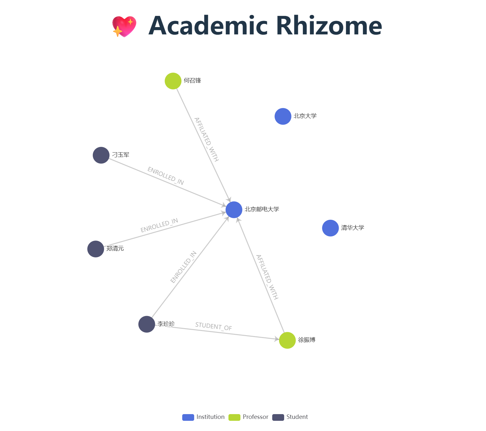

# Academic Rhizome

一个基于图数据库的学术知识图谱可视化应用，帮助研究者探索和分析学术论文之间的关系网络。\


## 功能特性

- 🔍 **交互式图谱可视化**：基于 ECharts 的力导向图布局
- 📊 **详细信息展示**：悬停显示节点和关系的完整属性
- 🎯 **智能布局**：自适应图谱大小和节点分布
- 🔗 **关系网络分析**：展示学术实体间的复杂关系
- 📱 **响应式设计**：适配不同屏幕尺寸

## 技术栈

### 前端
- Vue.js 3 (Composition API)
- Vite
- ECharts
- Axios

### 后端
- Flask
- Neo4j 图数据库
- Pydantic (数据验证)
- Flask-CORS

## 项目结构

```
academic_rhizome/
├── frontend/           # Vue.js 前端应用
│   ├── src/
│   │   ├── components/ # 可复用组件
│   │   ├── views/      # 页面视图
│   │   └── main.js     # 应用入口
│   ├── package.json
│   └── vite.config.js
├── backend/            # Flask 后端API
│   ├── app/
│   │   ├── routes/     # 路由定义
│   │   ├── services/   # 业务逻辑
│   │   ├── models/     # 数据模型
│   │   └── core/       # 核心配置
│   ├── run.py          # 应用启动文件
│   └── requirements.txt
└── README.md
```

## 快速开始

### 环境要求

- Python 3.8+
- Node.js 16+
- Neo4j 数据库

### 安装依赖

#### 后端设置
```bash
cd backend
pip install -r requirements.txt
```

#### 前端设置
```bash
cd frontend
npm install
```

### 配置数据库

1. 安装并启动 Neo4j 数据库
2. 在 `backend/app/core/config.py` 中配置数据库连接信息
3. 用户名neo4j 密码neo4j12345678

### 运行应用

#### 启动后端服务
```bash
cd backend
python run.py
```

#### 启动前端开发服务器
```bash
cd frontend
npm run dev
```

应用将在 `http://localhost:5173` 运行

## API 文档

### 获取图谱数据
```
GET /api/graph
```

返回格式化的图谱数据，包含节点和边的信息。

